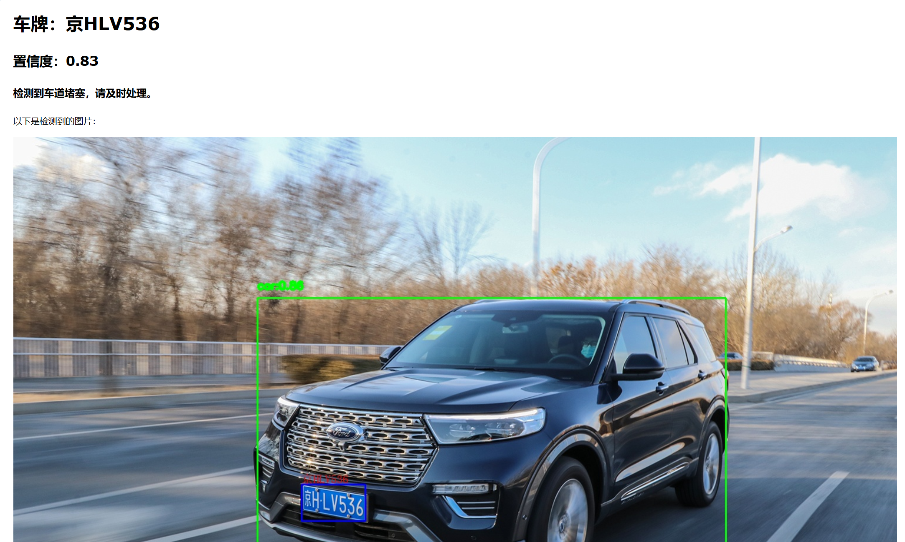

# LaneSentry

### 版本： *Demo-0.3*

#### 作者： 游水之空 Youshuizhikon

#### 一个基于深度学习的消防通道车辆车牌检测工具

🚗 **车辆与车牌检测** | 🛠️ **基于YOLOv11与ONNX构建** | 📊 **可视化看板**

## 📸 演示效果



## 🔍 项目概述

LaneSentry 是一个AI驱动的交通监控解决方案，具备以下功能：

- **实时车辆检测**：基于YOLOv11的车辆识别
- **车牌二次识别**：通过二级YOLO模型精确定位车牌
- **车牌文字识别**：利用cnocr进行车牌字符识别并显示
- **微信堵塞通知**：根据检测结果发送通知
- **边缘计算优化**：使用ONNX Runtime实现高效推理

## 🚀 应用场景

适用于消防通道车辆检测，避免堵塞引起的紧急情况。

## 🛠️ 安装指南

```CLI
git clone https://github.com/Youshuizhikon/LaneSentry.git
cd LaneSentry
#pip install uv # 如果没有安装uv
uv sync  # 最好Python 3.12+
python run mian.py
```

## 📅更新介绍

- **Demo-0.4**：现版本，添加**邮箱通知功能**，请到EamilSend.py中配置。
- **Demo-0.3**：在main.py中集成OCR功能以**识别车牌文字**并绘制到图像上。
- **Demo-0.2**: 添加**车牌检测**功能，修改为图片获取。修正坐标标注缩放逻辑。
- **Demo-0.1**: 初始版本，集成YOLOv11**车辆检测**模型。